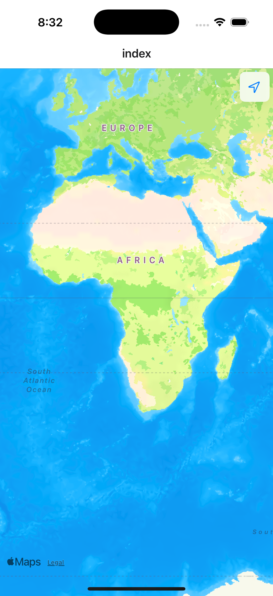
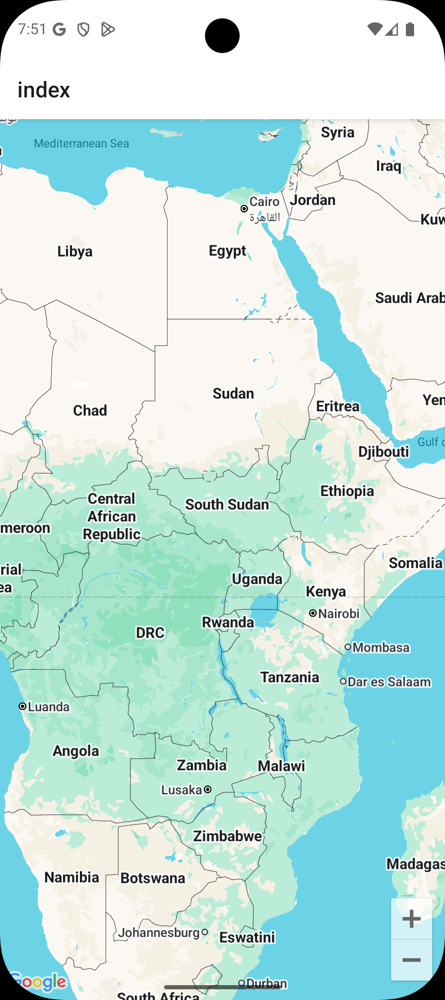

# Expo Maps Demo 📍

A React Native application built with Expo that demonstrates native map integration using the `expo-maps` library. This app showcases how to implement platform-specific maps (Apple Maps on iOS and Google Maps on Android) in a single codebase.

## Features ✨

- **Platform-specific maps**: Automatically uses Apple Maps on iOS and Google Maps on Android
- **Native performance**: Leverages native map implementations for optimal performance
- **Location permissions**: Handles location permissions with user-friendly prompts
- **Cross-platform**: Works seamlessly across iOS and Android devices
- **TypeScript support**: Built with TypeScript for better development experience

## Screenshots 📱

| iOS (Apple Maps)                                                           | Android (Google Maps)                                                              |
| -------------------------------------------------------------------------- | ---------------------------------------------------------------------------------- |
|            |            |

_Note: Screenshots show the native map integration on both platforms - Apple Maps on iOS and Google Maps on Android._

## Prerequisites 🛠️

Before running this project, make sure you have:

- [Node.js](https://nodejs.org/) (v18 or higher)
- [Expo CLI](https://docs.expo.dev/get-started/installation/)
- [Expo Go](https://expo.dev/go) app on your mobile device (for testing)
- iOS Simulator (for iOS development) or Android Emulator (for Android development)

## Environment Setup 🔑

### Google Maps API Key (Required for Android)

1. Get a Google Maps API key from the [Google Cloud Console](https://console.cloud.google.com/)
2. Enable the Maps SDK for Android
3. Create a `.env` file in the root directory and add:
   ```
   EXPO_PUBLIC_GOOGLE_MAPS_API_KEY=your_google_maps_api_key_here
   ```

### Apple Maps (iOS)

Apple Maps works out of the box on iOS devices without additional API keys.

## Installation 📦

1. **Clone the repository**

   ```bash
   git clone <your-repo-url>
   cd expo-maps
   ```

2. **Install dependencies**

   ```bash
   npm install
   ```

3. **Set up environment variables**
   ```bash
   cp .env.example .env
   # Edit .env and add your Google Maps API key
   ```

## Running the App 🚀

### Development Mode

Start the development server:

```bash
npx expo start
```

This will open the Expo DevTools in your browser. You can then:

- **Scan the QR code** with Expo Go on your mobile device
- **Press 'i'** to open in iOS Simulator
- **Press 'a'** to open in Android Emulator
- **Press 'w'** to open in web browser (note: maps won't work on web)

### Platform-specific Commands

```bash
# Run on iOS
npm run ios

# Run on Android
npm run android

# Run on web
npm run web
```

## Project Structure 📁

```
expo-maps/
├── app/                    # Expo Router app directory
│   ├── _layout.tsx        # Root layout configuration
│   └── index.tsx          # Main screen with map implementation
├── assets/                # Static assets (images, fonts)
├── android/               # Android-specific configuration
├── ios/                   # iOS-specific configuration
├── app.config.ts          # Expo configuration
├── package.json           # Dependencies and scripts
└── README.md             # This file
```

## Key Dependencies 📚

- **expo-maps**: Native map integration for iOS and Android
- **expo-router**: File-based routing for React Native
- **react-native**: Core React Native framework
- **expo**: Expo SDK for cross-platform development

## Configuration ⚙️

The app is configured in `app.config.ts` with:

- **iOS**: Apple Maps integration with location permissions
- **Android**: Google Maps integration with API key configuration
- **Permissions**: Location access permissions for both platforms
- **Splash screen**: Custom splash screen configuration

## Development Notes 💡

### Platform Detection

The app uses React Native's `Platform.OS` to detect the current platform and render the appropriate map component:

```typescript
if (Platform.OS === "ios") {
  return <AppleMaps.View style={{ flex: 1 }} />;
} else if (Platform.OS === "android") {
  return <GoogleMaps.View style={{ flex: 1 }} />;
}
```

### Location Permissions

The app requests location permissions on startup to provide a better map experience. Users will see a permission prompt when they first open the app.

## Building for Production 🏗️

### Using EAS Build

1. **Install EAS CLI**

   ```bash
   npm install -g @expo/eas-cli
   ```

2. **Login to Expo**

   ```bash
   eas login
   ```

3. **Configure EAS**

   ```bash
   eas build:configure
   ```

4. **Build for platforms**

   Add --local if you want to build on your own machine

   ```bash
   # Build for iOS
   eas build --platform ios

   # Build for Android
   eas build --platform android
   ```

## Troubleshooting 🔧

### Common Issues

1. **Maps not loading on Android**

   - Ensure you have a valid Google Maps API key in your `.env` file
   - Verify the API key has Maps SDK for Android enabled

2. **Location permissions not working**

   - Check that the `expo-maps` plugin is properly configured in `app.config.ts`
   - Ensure location permissions are declared in the app configuration

3. **Build errors**
   - Clear Expo cache: `npx expo start --clear`
   - Delete `node_modules` and reinstall: `rm -rf node_modules && npm install`

## Contributing 🤝

1. Fork the repository
2. Create a feature branch: `git checkout -b feature/amazing-feature`
3. Commit your changes: `git commit -m 'Add amazing feature'`
4. Push to the branch: `git push origin feature/amazing-feature`
5. Open a Pull Request

## Resources 📖

- [Expo Documentation](https://docs.expo.dev/)
- [expo-maps Documentation](https://docs.expo.dev/versions/latest/sdk/maps/)
- [React Native Documentation](https://reactnative.dev/)
- [Expo Router Documentation](https://docs.expo.dev/router/introduction/)

## Support 💬

If you encounter any issues or have questions:

- You can find me on twitter or linkedIn
- [Twitter](https://x.com/ajaymaurya1008)
- [LinkedIn](https://www.linkedin.com/in/ajaymaurya1008)
